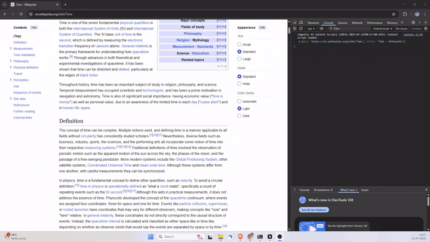

# Ask Ajith - Chrome Extension (Agentic)

A powerful Chrome extension that uses Google's Gemini 2.0 Flash AI model to provide intelligent agentic analysis, research, writing, and code generation tasks through right-click context menus.




```

## Setup Instructions

### 1. Install FastAPI Server Dependencies

```bash
# Create a virtual environment
python -m venv agentic_ai_env
source agentic_ai_env/bin/activate  # On Windows: agentic_ai_env\Scripts\activate

# Install dependencies
pip install fastapi uvicorn pydantic google-generativeai python-multipart
```

### 2. Setup Gemini API Key

1. Get your Gemini API key from [Google AI Studio](https://makersuite.google.com/app/apikey)
2. Replace `YOUR_GEMINI_API_KEY_HERE` in the Python code with your actual API key

### 3. Run the FastAPI Server

```bash
# Save the Python code as main.py
python main.py

# Or use uvicorn directly
uvicorn main:app --reload --host 0.0.0.0 --port 8000
```

The server will be available at `http://localhost:8000`

### 4. Chrome Extension Setup

Create these files in a new folder:

**manifest.json**
```json

```

**background.js** (copy from the Python code comments)

**agentic-popup.css** (copy from above)

### 5. Load the Extension

1. Open Chrome and go to `chrome://extensions/`
2. Enable "Developer mode"
3. Click "Load unpacked" and select your extension folder

## How to Use

### Basic Usage
1. Select any text on a webpage
2. Right-click and choose from:
   - 🤖 Agentic Analysis
   - 🔍 Research Assistant  
   - ✍️ Writing Assistant
   - 💻 Code Assistant

### Advanced Features

The agentic AI system provides:

- **Multi-step reasoning**: Breaks complex tasks into manageable steps
- **Self-evaluation**: Checks and improves its own outputs
- **Adaptive planning**: Creates dynamic execution plans based on input analysis
- **Quality scoring**: Provides confidence scores for each step
- **Context awareness**: Maintains context across all processing steps

### API Endpoints

- `POST /agent/execute` - Execute agentic tasks
- `POST /agent/chat` - Simple chat interface
- `GET /agent/status` - Check agent capabilities
- `GET /` - Health check

### Example API Usage

```javascript
// Direct API call
const response = await fetch('http://localhost:8000/agent/execute', {
  method: 'POST',
  headers: { 'Content-Type': 'application/json' },
  body: JSON.stringify({
    text: "Explain quantum computing",
    task_type: "analyze",
    context: { domain: "technical" },
    user_preferences: { format: "detailed", tone: "educational" }
  })
});

const result = await response.json();
console.log(result);
```

## Key Features

### 1. Agentic Reasoning
- Multi-step task decomposition
- Adaptive planning based on input analysis
- Self-evaluation and refinement
- Context-aware execution

### 2. Quality Assurance
- Confidence scoring for each step
- Automatic result improvement for low-quality outputs
- Final result synthesis and evaluation

### 3. User Experience
- Real-time progress indication
- Detailed execution transparency
- Step-by-step reasoning display
- Easy result copying and refinement

### 4. Extensibility
- Modular architecture
- Easy to add new task types
- Configurable user preferences
- API-first design

What Makes This "Agentic":

Goal-oriented: Each task has a clear goal and success criteria
Multi-step execution: Complex reasoning chains with intermediate steps
Self-monitoring: Quality checks and confidence scoring
Adaptive behavior: Plans change based on input analysis
Autonomous refinement: Improves its own outputs without human intervention


## Troubleshooting

### Common Issues

1. **Server not starting**: Check if port 8000 is available
2. **API key errors**: Ensure your Gemini API key is valid
3. **Extension not loading**: Check manifest.json syntax
4. **CORS errors**: Server includes CORS middleware for all origins

### Development Tips

1. Use `uvicorn main:app --reload` for development
2. Check browser console for extension errors
3. Monitor server logs for API issues
4. Test with simple text selections first

This agentic AI system provides a sophisticated foundation for building intelligent applications that can reason, plan, and execute complex tasks autonomously while maintaining transparency and user control.